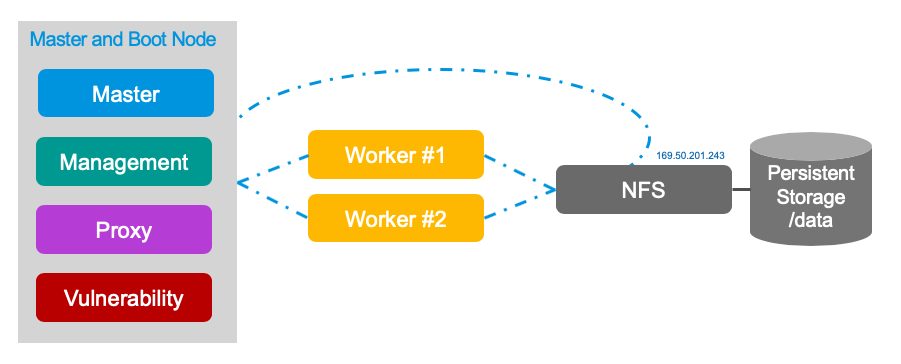
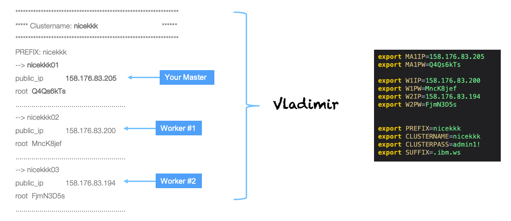
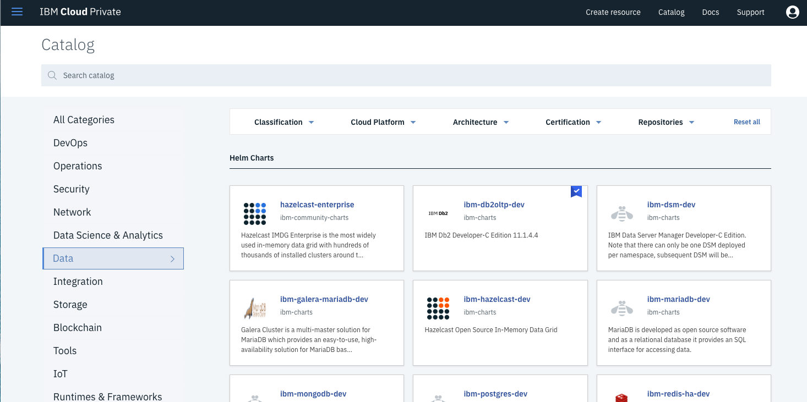

# Multi-Node Cluster Installation Lab

The purpose of this lab is to install a complete IBM Cloud Private cluster running on multiple nodes.

> **Prerequisites** : you should have defined 3 (virtual) machines (RHEL version 7.6) and collected IP addresses and root passwords for these 3 machines.


---


# Task 1: Prerequisites

Before you start installing IBM Cloud Private, you must provision a set of four machines using your favorite vitualization tools or your prefered cloud infrastructure :
- One master node (including boot node, management node, va node, proxy node) : 8 vcores, 32 GB (RAM), 300 GB (Storage), one IP
- Two worker nodes:  8  vcores, 16 GB (RAM), 100 GB (Storage), one IP per worker
- One VM for NFS with NFS configured.
- All nodes are running RHEL version 7.6
- ICP Enterprise Edition - version 3.1.2





Let's say that we have a **prefix hostname** (**nicekkk** in my example). Then each node will get a complementary character or string at the end :
- 01 : example - nicekkk01 for the master node (and all the other nodes included - see above)
- 02 or 03 : example - nicexkkk02 and nicekkk03 for the worker nodes
- The NFS node name is not involved at this point

**A list of VMs will be given to you during the workshop.** 





You have all the IPs, passwords for the 3 VMs (1 master and 2 workers). Your prefix and cluster name should the same and is specified in the document.  The suffix is always '.ibm.ws'. And password is always admin1!

> **Please don't change the prefix name, cluster name, cluster password and suffix name.**

All machines should be **up** and **running**. They also must be **accessible** to each other. 

Everything has been made with automation in mind. 


# Task 2: Step by step configuration

### Step 1: Login to the master machine

You must ssh or putty to the **master node**:

**Login to your master**/boot node by using the following command (change with you master IP address) :

`ssh root@<masterip>`

Where the <masterip> is the first ip address (finishing by 01) of your group of VMs.

You are going to stay on the Master node during all the exercise.

### Step 2: Setup the credentials for all machines

Prepare the following set of commands to set variables.

Then you need to type all IPs and root passwords in a list like the one below (**please change the IPs and passwords, prefix and suffix accordingly to the ones you received**) :

```console
export MA1IP=
export MA1PW=
export W1IP=
export W1PW=
export W2IP=
export W2PW=
export PREFIX=
export CLUSTERNAME=
export CLUSTERPASS=admin1!
export SUFFIX=.ibm.ws
```

> Note that in this lab, all machines will be accessed using the super user **root**.
>
> CLUSTERNAME and PREFIX are identical.
>
> CLUSTERPASS=admin1!
>
> SUFFIX=.ibm.ws

Here is an example :

```console
export MA1IP=158.176.83.205
export MA1PW=Q4Qs6kTs
export W1IP=158.176.83.200
export W1PW=MncK8jef
export W2IP=158.176.83.194
export W2PW=FjmN3D5s
export PREFIX=nicekkk
export CLUSTERNAME=nicekkk
export CLUSTERPASS=admin1!
export SUFFIX=.ibm.ws
```


###Step 3: Create a credential file for all your nodes

We need to create a credentials file for some next steps (to distribute automaticaly all keys and /etc/hosts to all nodes). 

Please **copy, paste and execute** the following commands in the master terminal:

```console
cd /root/.ssh
cat <<END > credentials
root:$W1PW@$W1IP
root:$W2PW@$W2IP
END
```

Check the output with the following command :

`more credentials`

Results (as an example):

```console
# more credentials 
root:MncK8jef@158.176.83.200
root:FjmN3D5s@158.176.83.194
```

###Step 4: Configure the /etc/hosts

We now need to create an **/etc/hosts** file for all nodes. **Execute** the following commands:

```console 
echo "127.0.0.1 localhost localhost.localdomain localhost4 localhost4.localdomain4" > /etc/hosts
echo "$MA1IP ${PREFIX}01  ${PREFIX}01${SUFFIX}" >> /etc/hosts
echo "$W1IP  ${PREFIX}02  ${PREFIX}02${SUFFIX}" >> /etc/hosts
echo "$W2IP  ${PREFIX}03  ${PREFIX}03${SUFFIX}" >> /etc/hosts
```
> Note : the dns suffix name used here is .ibm.ws could not be change for this lab.

Check the results (as an example):

```console
# more /etc/hosts
127.0.0.1 localhost localhost.localdomain localhost4 localhost4.localdomain4
158.176.83.205  nicekkk01  nicekkk01.ibm.ws
158.176.83.200  nicekkk02  nicekkk02.ibm.ws
158.176.83.194  nicekkk03  nicekkk03.ibm.ws
```


#Task 3: Install Docker on the master node

First, you need to create a file that will be used to install Docker on the master and all the other  nodes. 

To do so execute the following command:
```console
cd /root

cat << 'END' > dockerinstall.sh
yum check-update -y
yum-config-manager --add-repo https://download.docker.com/linux/centos/docker-ce.repo
yum install -y docker-ce-18.03.1.ce-1.el7.centos
systemctl start docker
systemctl stop firewalld
systemctl disable firewalld
yum check-update -y
docker version
END
```

Then you can execute this script to install docker:
```console
chmod +x dockerinstall.sh
./dockerinstall.sh
```

This command should end with the following results:
```console 
Client:
 Version:      18.03.1-ce
 API version:  1.37
 Go version:   go1.9.5
 Git commit:   9ee9f40
 Built:        Thu Apr 26 07:20:16 2018
 OS/Arch:      linux/amd64
 Experimental: false
 Orchestrator: swarm

Server:
 Engine:
  Version:      18.03.1-ce
  API version:  1.37 (minimum version 1.12)
  Go version:   go1.9.5
  Git commit:   9ee9f40
  Built:        Thu Apr 26 07:23:58 2018
  OS/Arch:      linux/amd64
  Experimental: false

```

#Task 4: Download ICP installation code

You can get the ICP zip file into the Passport Advantage IBM web site.

However, in your **/root** directory, we already have copied this zip file (**ibm-cloud-private-x86_64-3.1.2.tar.gz**):

```
# cd root
# ls -al
total 13046976
drwxr-xr-x. 2 root root        4096 Mar 22 04:33 .
drwxr-xr-x. 8 root root        4096 Mar 22 05:17 ..
-rw-r--r--. 1 root root 13347036806 Mar 21 18:41 ibm-cloud-private-x86_64-3.1.2.tar.gz
```

Execute the following commands:

```console
cd /root
tar xf ibm-cloud-private-x86_64-3.1.2.tar.gz -O | docker load
```

This unzips and loads docker images in your private registry. It  can last **5 to 10 minutes**. Please wait and grab a coffee. 

#Task 5: Create ssh keys

On the master, we need to generate ssh keys that will copied across the cluster for **secure communications**. 

**Execute** the following commands:

```console 
mkdir /opt/icp
cd /opt/icp
docker run -v $(pwd):/data -e LICENSE=accept ibmcom/icp-inception-amd64:3.1.2-ee cp -r cluster /data

ssh-keygen -b 4096 -f ~/.ssh/id_rsa -N ""
cat ~/.ssh/id_rsa.pub | tee -a ~/.ssh/authorized_keys
systemctl restart sshd
\cp -f ~/.ssh/id_rsa /opt/icp/cluster/ssh_key

```

> The result : id_rsa key is copied in the cluster directory.

Check the results:

```console
cd /opt/icp/cluster
[root@nicekkk01 cluster]# ls
cfc-certs  cfc-components  config.yaml  hosts logs  ssh_key

```

Move the ICP zip file into another location:

```console
cd /opt/icp
mkdir -p cluster/images
mv /root/ibm-cloud-private-x86_64-3.1.2.tar.gz  cluster/images/
```


### Distribute ssh keys on the other nodes

**Execute**  2 commands to **distribute** the keys and restart **sshd** on all nodes (these commands use sshpass that will transfer the pasword when requested):

```console
cd /root/.ssh

tr ':@' '\n' < credentials | xargs -L3 sh -c 'sshpass -p $1 ssh-copy-id -o StrictHostKeyChecking=no -f $0@$2'
tr ':@' '\n' < credentials | xargs -L3 sh -c 'ssh -o StrictHostKeyChecking=no $0@$2 systemctl restart sshd'
```

### Copy /etc/hosts on all nodes

**Execute** 2 commands to copy remotely /etc/hosts on all nodes:

```console
tr ':@' '\n' < credentials | xargs -L3 sh -c 'scp -o StrictHostKeyChecking=no /etc/hosts $0@$2:/etc/hosts'
tr ':@' '\n' < credentials | xargs -L3 sh -c 'ssh -o StrictHostKeyChecking=no $0@$2 rm -rf ibm-cloud-private-x86_64-3.1.2.tar.gz'
```

# Task 6: Configure ICP Installation

**Execute** this first command to define the ICP topology (one master and 2 workers). The management, the proxy and the VA (Vulnerability) are hosted in the master node:

```console 
cat <<END > /opt/icp/cluster/hosts
[master]
$MA1IP

[worker]
$W1IP
$W2IP

[proxy]
$MA1IP

[management]
$MA1IP

[va]
$MA1IP
END
```

Configure ICP file (config.yaml):

```console
cd /opt/icp/cluster
sed -i "s/# cluster_name: mycluster/cluster_name: $CLUSTERNAME/g" /opt/icp/cluster/config.yaml
sed -i 's/  vulnerability-advisor: disabled/  vulnerability-advisor: enabled/g' /opt/icp/cluster/config.yaml
sed -i 's/  istio: disabled/  istio: enabled/g' /opt/icp/cluster/config.yaml
sed -i "s/# default_admin_password:/default_admin_password: $CLUSTERPASS/g" /opt/icp/cluster/config.yaml
sed -i 's/# install_docker: true/install_docker: true/g' /opt/icp/cluster/config.yaml
echo "password_rules:" >> /opt/icp/cluster/config.yaml
echo "- '(.*)'" >> /opt/icp/cluster/config.yaml
```

> Note: These commands will configure config.yaml file to change the following:
>
> - cluster name is set
> - VA (Vulnerability Advisor) will be installed in the master node
> - Istio will be installed
> - Admin password is set
> - Docker will be installed automatically on the worker nodes
> - Password rule is set to anything


#Task 7: Install ICP Enterprise Edition

Type the following command to install ICP Cluster on the 3 nodes:

```console
cd /opt/icp/cluster
docker run --net=host -t -e LICENSE=accept -v "$(pwd)":/installer/cluster ibmcom/icp-inception-amd64:3.1.2-ee install
```
> Note : the installation should take 30 minutes. So, if you don't see any error during the first 5 minutes, take another coffee. 

> Note : in case of error, you can retry the installation command or you can use the **uninstall** process :
```console 
cd /opt/icp/cluster
docker run --net=host -t -e LICENSE=accept -v "$(pwd)":/installer/cluster ibmcom/icp-inception-amd64:3.1.2-ee uninstall
```

At the end of the ICP installation, you will get the following results:


Take a note of the URL : `https://<masterip>:8443`

Check your connection by using this URL:


Got to the Dashboard: click on the hamburger **menu > Dashboard:**


# Task 8: CLI installations

**kubectl** has been already installed :

 ```console 
# kubectl
kubectl controls the Kubernetes cluster manager. 

Find more information at: https://kubernetes.io/docs/reference/kubectl/overview/

Basic Commands (Beginner):
  create         Create a resource from a file or from stdin.
  expose         Take a replication controller, service, deployment or pod and expose it as a new Kubernetes Service
  run            Run a particular image on the cluster
  set            Set specific features on objects

Basic Commands (Intermediate) ...
 ```

Install the **cloudctl** CLI command by **executing** the following commands:

```console
cd /root
curl -kLo cloudctl-linux-amd64-3.1.2-1203 https://$MA1IP:8443/api/cli/cloudctl-linux-amd64
chmod 755 /root/cloudctl-linux-amd64-3.1.2-1203
mv /root/cloudctl-linux-amd64-3.1.2-1203 /usr/local/bin/cloudctl
```

> cloudctl command is a usefull command to modify the infrastructure level of the cluster (like adding a new node or load helm repo). 


Modify the **connect2icp** command by executing the following commands:

```console
cd /root
sed -i "s/CLUSTERNAME=mycluster/CLUSTERNAME=$CLUSTERNAME/g" /root/connect2icp.sh
sed -i "s/PASSWD=admin/PASSWD=$CLUSTERPASS/g" /root/connect2icp.sh
chmod +x connect2icp.sh
./connect2icp.sh
```

> connect2icp.sh is a shell script to be executed after 12 hours (a token needs to renewed). This command tells kubectl where to connect.


Use the **cloudctl** command to **login** to the cluster (prerequisites before you install helm):

```console
cloudctl login -a https://$CLUSTERNAME.icp:8443 --skip-ssl-validation -u admin -p $CLUSTERPASS -n default
```

Results:


 Install helm with the following commands:

```console
cd
curl -O https://storage.googleapis.com/kubernetes-helm/helm-v2.9.1-linux-amd64.tar.gz
tar -vxhf helm-v2.9.1-linux-amd64.tar.gz
export PATH=/root/linux-amd64:$PATH
export HELM_HOME=/root/.helm
helm init --client-only
helm version --tls

docker login $CLUSTERNAME.icp:8500 -u admin -p $CLUSTERPASS
```


Results: 

```console
Configuring helm: /root/.helm
OK
  % Total    % Received % Xferd  Average Speed   Time    Time     Time  Current
                                 Dload  Upload   Total   Spent    Left  Speed
100 8946k  100 8946k    0     0  24.4M      0 --:--:-- --:--:-- --:--:-- 24.4M
linux-amd64/
linux-amd64/README.md
linux-amd64/helm
linux-amd64/LICENSE
Creating /root/.helm/repository 
Creating /root/.helm/repository/cache 
Creating /root/.helm/repository/local 
Creating /root/.helm/plugins 
Creating /root/.helm/starters 
Creating /root/.helm/cache/archive 
Creating /root/.helm/repository/repositories.yaml 
Adding stable repo with URL: https://kubernetes-charts.storage.googleapis.com 
Adding local repo with URL: http://127.0.0.1:8879/charts 
$HELM_HOME has been configured at /root/.helm.
Not installing Tiller due to 'client-only' flag having been set
Happy Helming!
Client: &version.Version{SemVer:"v2.9.1", GitCommit:"20adb27c7c5868466912eebdf6664e7390ebe710", GitTreeState:"clean"}
Server: &version.Version{SemVer:"v2.9.1+icp", GitCommit:"8ddf4db6a545dc609539ad8171400f6869c61d8d", GitTreeState:"clean"}
WARNING! Using --password via the CLI is insecure. Use --password-stdin.
Login Succeeded

```

**Persistent volumes** : for our first installation, we need to have some basic hostpath volumes.

 Type the following commands:

```console
cd /tmp
mkdir data01

cat <<EOF | kubectl create -f -
apiVersion: v1
kind: PersistentVolume
metadata:
  name: hostpath-pv-once-test1
spec:
  accessModes:
  - ReadWriteOnce
  capacity:
    storage: 50Gi
  hostPath:
    path: /tmp/data01
  persistentVolumeReclaimPolicy: Recycle
EOF

cat <<EOF | kubectl create -f -
apiVersion: v1
kind: PersistentVolume
metadata:
  name: hostpath-pv-many-test1
spec:
  accessModes:
  - ReadWriteMany
  capacity:
    storage: 50Gi
  hostPath:
    path: /tmp/data01
  persistentVolumeReclaimPolicy: Recycle
EOF

cd /root
```


# Task 9: Check your ICP console

Type the following URL in your browser:

`https://<masterip>:8443`

Go to the **menu** (top left), click on **Dashboard**


Check the number of nodes (3), the 48% of available storage and the 61 healthy pods.

Go to the **menu** (top left), click on **Platform** then on **Storage**:


At this point you should see your 2 new Hostpath Persistent storage.

Click on the **Catalog** menu (top right) to look at the list of applications already installed:


The **Catalog** shows Charts that you can visit (it could take au few seconds to refresh the first time)

You can look at the (helm) catalog and visit some entries (but don't create any application at the moment).




# Congratulations 

You have successfully installed, deployed and customized the Kubernetes Cluster for an **IBM Cloud Private Enterprise Edition** !

You finally went thru the following features :

- [x] You setup a VM using RHEL version 7.6

- [x] You checked all the prerequisites before the ICP installation

- [x] You installed Docker

- [x] You installed ICP Enterprise Edition (version 3.1.2) on a multi-node cluster

- [x] You connected to the ICP console

- [x] You setup some persistent storage

- [x] You installed a functional Kubernetes Cluster on a 3 nodes for testing and learning


# Appendix: "All in One" Script 

Find below one script file for the automated installation (All in one script - dont forget to change the IPs, passwords and prefix):

```console
#!/bin/bash
# ICP 3.1.2 - Docker 18.03.1 - RHEL 7.5 - Automatic Docker - EE
# One Master/VA/Proxy, 2 Worksers
# Enterprise Edition
#################################
date

# Variables to be set

export MA1IP=158.176.83.205
export MA1PW=Q4Qs6kTs

export W1IP=158.176.83.200
export W1PW=MncK8jef
export W2IP=158.176.83.194
export W2PW=FjmN3D5s

export PREFIX=nicekkk
export CLUSTERNAME=nicekkk
export CLUSTERPASS=admin1!  
export SUFFIX=.ibm.ws

# Create Credentials (excluding Master)

cd /root/.ssh

cat <<END > credentials
root:$W1PW@$W1IP
root:$W2PW@$W2IP
END

# Create /etc/hosts

echo "127.0.0.1 localhost localhost.localdomain localhost4 localhost4.localdomain4" > /etc/hosts
echo "$MA1IP ${PREFIX}01  ${PREFIX}01${SUFFIX}" >> /etc/hosts
echo "$W1IP  ${PREFIX}02  ${PREFIX}02${SUFFIX}" >> /etc/hosts
echo "$W2IP  ${PREFIX}03  ${PREFIX}03${SUFFIX}" >> /etc/hosts


# Create Docker install script on the boot

cd /root
cat << 'END' > dockerinstall.sh
yum check-update -y
yum-config-manager --add-repo https://download.docker.com/linux/centos/docker-ce.repo
yum install -y docker-ce-18.03.1.ce-1.el7.centos
systemctl start docker
systemctl stop firewalld
systemctl disable firewalld
yum check-update -y
docker version
END

# Install Docker on the master

chmod +x dockerinstall.sh
./dockerinstall.sh


# Upload installation file to the Master in /root for icp-ee
##
cd /root
tar xf ibm-cloud-private-x86_64-3.1.2.tar.gz -O | docker load

# Copy Config Files for icp-ee
##
mkdir /opt/icp
cd /opt/icp
docker run -v $(pwd):/data -e LICENSE=accept ibmcom/icp-inception-amd64:3.1.2-ee cp -r cluster /data


# Create Keys 
ssh-keygen -b 4096 -f ~/.ssh/id_rsa -N ""
cat ~/.ssh/id_rsa.pub | tee -a ~/.ssh/authorized_keys
systemctl restart sshd
\cp -f ~/.ssh/id_rsa /opt/icp/cluster/ssh_key


# Copy the installation file to images
##
cd /opt/icp
mkdir -p cluster/images
mv /root/ibm-cloud-private-x86_64-3.1.2.tar.gz  cluster/images/


# From the master - Install Hosts, Docker, restart SSH and copy keys on each NODE
cd /root/.ssh


tr ':@' '\n' < credentials | xargs -L3 sh -c 'sshpass -p $1 ssh-copy-id -o StrictHostKeyChecking=no -f $0@$2'
tr ':@' '\n' < credentials | xargs -L3 sh -c 'ssh -o StrictHostKeyChecking=no $0@$2 systemctl restart sshd'
tr ':@' '\n' < credentials | xargs -L3 sh -c 'scp -o StrictHostKeyChecking=no /etc/hosts $0@$2:/etc/hosts'
tr ':@' '\n' < credentials | xargs -L3 sh -c 'ssh -o StrictHostKeyChecking=no $0@$2 rm -rf ibm-cloud-private-x86_64-3.1.2.tar.gz'


# Customize hosts before installing ICP
cat <<END > /opt/icp/cluster/hosts
[master]
$MA1IP

[worker]
$W1IP
$W2IP

[proxy]
$MA1IP

[management]
$MA1IP

[va]
$MA1IP
END

# configure ICP
cd /opt/icp/cluster
sed -i "s/# cluster_name: mycluster/cluster_name: $CLUSTERNAME/g" /opt/icp/cluster/config.yaml
sed -i 's/  vulnerability-advisor: disabled/  vulnerability-advisor: enabled/g' /opt/icp/cluster/config.yaml
sed -i 's/  istio: disabled/  istio: enabled/g' /opt/icp/cluster/config.yaml
sed -i "s/# default_admin_password:/default_admin_password: $CLUSTERPASS/g" /opt/icp/cluster/config.yaml
sed -i 's/# install_docker: true/install_docker: true/g' /opt/icp/cluster/config.yaml


echo "password_rules:" >> /opt/icp/cluster/config.yaml
echo "- '(.*)'" >> /opt/icp/cluster/config.yaml


# Installation ICP-EE
cd /opt/icp/cluster
docker run --net=host -t -e LICENSE=accept -v "$(pwd)":/installer/cluster ibmcom/icp-inception-amd64:3.1.2-ee install


# Connection to ICP on the master
cd /root
curl -kLo cloudctl-linux-amd64-3.1.2-1203 https://$MAIP:8443/api/cli/cloudctl-linux-amd64
chmod 755 /root/cloudctl-linux-amd64-3.1.2-1203
mv /root/cloudctl-linux-amd64-3.1.2-1203 /usr/local/bin/cloudctl

# Modify connect2icp to support clustername and password

sed -i "s/CLUSTERNAME=mycluster/CLUSTERNAME=$CLUSTERNAME/g" /root/connect2icp.sh
sed -i "s/PASSWD=admin/PASSWD=$CLUSTERPASS/g" /root/connect2icp.sh

chmod +x connect2icp.sh
./connect2icp.sh

cloudctl login -a https://$CLUSTERNAME.icp:8443 --skip-ssl-validation -u admin -p $CLUSTERPASS -n default


# Installing HELM
cd
curl -O https://storage.googleapis.com/kubernetes-helm/helm-v2.9.1-linux-amd64.tar.gz
tar -vxhf helm-v2.9.1-linux-amd64.tar.gz
export PATH=/root/linux-amd64:$PATH
export HELM_HOME=/root/.helm
helm init --client-only
helm version --tls

docker login $CLUSTERNAME.icp:8500 -u admin -p $CLUSTERPASS

# Installing Persistent Storage in the Master
cd /tmp
mkdir data01

cat <<EOF | kubectl create -f -
apiVersion: v1
kind: PersistentVolume
metadata:
  name: hostpath-pv-once-test1
spec:
  accessModes:
  - ReadWriteOnce
  capacity:
    storage: 50Gi
  hostPath:
    path: /tmp/data01
  persistentVolumeReclaimPolicy: Recycle
EOF

cat <<EOF | kubectl create -f -
apiVersion: v1
kind: PersistentVolume
metadata:
  name: hostpath-pv-many-test1
spec:
  accessModes:
  - ReadWriteMany
  capacity:
    storage: 50Gi
  hostPath:
    path: /tmp/data01
  persistentVolumeReclaimPolicy: Recycle
EOF

cd /root

# End
date


```


